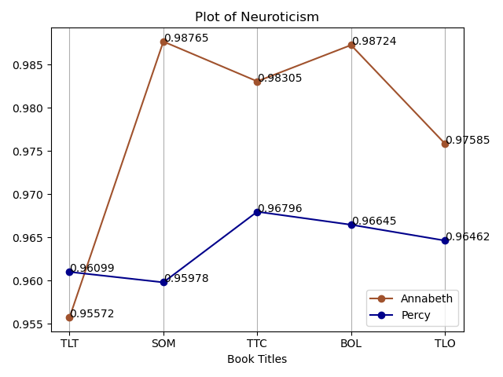

# Analysis of Character Development in Book Series

## Introduction

This code was part of a group project I did in university in 2020 that I have recently cleaned up to be uploaded on GitHub.

The aim of this project was to analyze the character development of 2 characters across the book series, “Percy Jackson and the Olympians”. The characters we chose to focus on for the project were Annabeth and Percy, as they were 2 of the main characters in the series, and thus would have the most quotes compared to other characters in the books.

## How the code works

### Extracting quotes

Using a digital copy of the books, we used the ‘extract-quotes.ipynb’ file to extract the quotes of Annabeth and Percy across all the books in the series.

> [!NOTE]
> This repository will not contain the digital copies of the book (aka the 'raw-text' folder) we used to avoid copyright infringement.

- First, the code will go through each file in the 'raw-text' folder, and go line by line in each book to get only the lines with character text - this is indicated by lines with quotation marks. Then, it will export all the lines with character text into a seperate file for each book in the ‘processed-text’ folder.
- Using the above character text files, it will go through each line to identify whether the dialogue was said by Annabeth or Percy. Then, it will export each of the characters’ dialogue for each book into its own file in the ‘character-quotes’ folder.

**Distribution of quotes obtained**

We obtain a total of 4,973 character dialogue extracted - 1172 for Annabeth, and 3801 for Percy.

| **Character** | **The Lightning Thief** | **The Sea of Monsters** | **The Titan’s Curse** | **The Battle of the Labyrinth** | **The Last Olympian** | **Total** |
| :---: | :---: | :---: | :---: | :---: | :---: | :---: |
| Annabeth | 271 | 243 | 59 | 392 | 207 | 1172 |
| Percy | 769 | 547 | 749 | 775 | 961 | 3801 |

### Analyzing the text

To analyze the dialogue, we used the [pre-trained model by jkwieser](https://github.com/jkwieser/personality-prediction-from-text) in the ‘predict.ipynb’ file to assess the Big Five Personality of each character in each book. This is located in the ‘personality-detection-text-master’ folder.

- To find the Big Five Personality, the code will go through the character text file of each character, and go line by line in each file to get the Big Five Personality of each line.
- After going through all the lines for the character in the book, we will find the average across all the character's lines in the book to determine the Big Five Personality of the character for that book.
- Then, we tracked how each personality trait changed across each book to determine how their characters developed across the series, and linked the events in the book to these changes in personality.
- Lastly, we plot a graph of each of the Big Five Personality across each book to visualize how this changed for each character across all the books.

## Results

Figure 1: Plot of ‘Extraversion’ personality trait

Figure 2: Plot of ‘Neuroticism’ personality trait

Figure 3: Plot of ‘Agreeableness’ personality trait

Figure 4: Plot of ‘Conscientiousness’ personality trait

Figure 5: Plot of ‘Openness’ personality trait

## Limitations

Due to time constraints, the logic used to extract the quotes was limited and had some errors. As the project has been completed, these errors will not be fixed unless otherwise stated.

1. The method to get the character dialogue was limited and could not pick up everything in the text.
    - Some of the dialogue was not formatted properly in the copy of the books we used, so some quotes were not properly picked up.
        - For example, the following line has a missing quotation mark at the end of the dialogue in the original text file, and thus was not picked up as a dialogue for Annabeth.
            
            > Annabeth announced, "Percy Jackson, meet cabin eleven.
            
    - Furthermore, this method excluded lines with no dialogue tags, as it does not have the context of an ongoing conversation where it was mentioned in an earlier line who was speaking.
        - The following line is an example, which was said by Percy but was not picked up as it did not have dialogue tags from previous lines.
            
            > "About the Titans?"
            
    - Additionally, some of the ‘dialogue’ that was picked up was not actually dialogue, as was just phrases in quotation marks.
        - The following line is an example where the words “on call” was wrongly picked up as Percy’s dialogue, as it was in quotation marks and the word “I” was in the line.
            
            > Still, something big was supposed to go down any day now. I was "on call" for a mission. Even worse, next week was my birthday. There was this prophecy that said when I turned sixteen, bad things would happen.
            
2. Our logic to split up each character’s dialogue was limited and had errors as well.
    
    **Getting Annabeth’s dialogue**
    
    - Firstly, to get **Annabeth’s** dialogue, we first identified lines containing ‘Annabeth’ in the dialogue tags. For example: “Annabeth said”, “Annabeth prompted.”, etc.
    - We then checked if the dialogue tag contained words such as “I” or “I’d”. As Percy is the narrator of the series, we excluded lines that contained these words. This is to ensure it was not Percy’s dialogue, as he may have been describing Annabeth in the dialogue tag.
        - The following line is an example that was correctly filtered out from Annabeth’s dialogue.
            
            > "Sure we can," I said. I was irritated with Annabeth for being so bossy, so rude to an old lady who'd just fed us for free. "It's just a photo, Annabeth. What's the harm?"
            
        - However, using this logic did get a few lines to be wrongly filtered out, such as the following line, which should be part of Annabeth’s dialogue but was filtered out due to the word “I” being in it:
            
            > I didn't know what to say, but Annabeth said, "Undetermined."
    
    **Getting Percy’s dialogue**
    
    - Similarly, to get **Percy’s** dialogue, we first identified lines containing “I” in the dialogue tags. For example: “I said”, "I mumbled.”, etc.
    - We excluded lines that contained "I'd" or “Annabeth” to ensure that Percy wasn’t describing something someone else said.
        - The following is a line that was correctly filtered out.
            
            > I was pretty much in shock myself. The explosion of bus windows still rang in my ears. But Annabeth kept pulling us along, saying: "Come on! The farther away we get, the better."
            
        - However, as we only considered Percy and Annabeth at the time, this method incorrectly left some of the dialogue said by other characters and they were not filtered out. The following line is an example, where it was a line said by Chiron (Mr. Brunner), but was picked up under Percy’s dialogue as the dialogue tag contains the word “I”.
            
            > Grover and I were about to follow when Mr. Brunner said, "Mr. Jackson."

## Credits

The files in the "personality-detection-text-master" folder are from the [personality-prediction-from-text](https://github.com/jkwieser/personality-prediction-from-text) repository by [jkwieser](https://github.com/jkwieser), and has been modified to fit the project needs.